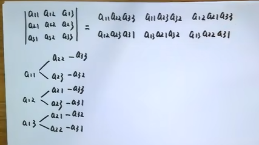
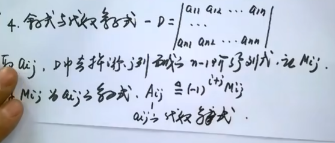
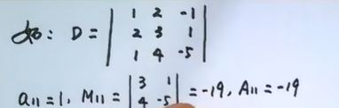

$m$个$n$元一次方程的方程组可以化为$m*n$维矩阵,在尾部加上每个方程的常数项的矩阵叫作增广矩阵

矩阵加法满足加法交换律、结合律，
乘法:$m$（列）$\times n$矩阵乘$n\times p$矩阵结果为一$m\times p$矩阵, 其中新矩阵的第$ij$个元素为$a_{i,r}b_{r,j}, r=1,\cdots,n$相加 
交换律不成立，消去律也不成立

单位矩阵$EA=A=AE$，左右式子的单位矩阵.若$Am$行$n$列，则左边单位矩阵为$E_m$，右边$E_n$

矩阵的转置把矩阵对应行转为对应列，满足线性性，数乘不变性，$(AB)^T=B^TA^T$

矩阵消元法

n元齐次线性方程组可以化为矩阵
消元
矩阵的出等行变换：不同行相加减，行自乘除，换行
阶梯形方程组（例：3x1+2x2+4x3=9；5x2+6x3=10；x3=17），在有理数或实数或复数内解方程，如出现0=d，无解；若非零行数量等于未知量数目，则有唯一解；若小于，则无穷多解。只有3种情况。
推论对于所有常数项都为零的方程组，有非零解当且仅当有无穷多个解。

行列式（例，二阶矩阵A：a11 a12 a21 a22，其二阶行列式为a11a22-a12a21，记为|A|或detA）
数域k上二元一次方程组A有唯一解iff |A|\not= 0 

 

$(i,j)$ 逆序 $i<j$
$\tau(i_1\cdots i_n)=$排列$i_1\cdots i_n$中逆序的对数
e.g. $\tau(132)=1$

$n$阶行列式即$n$行的行列式

代数余子式

